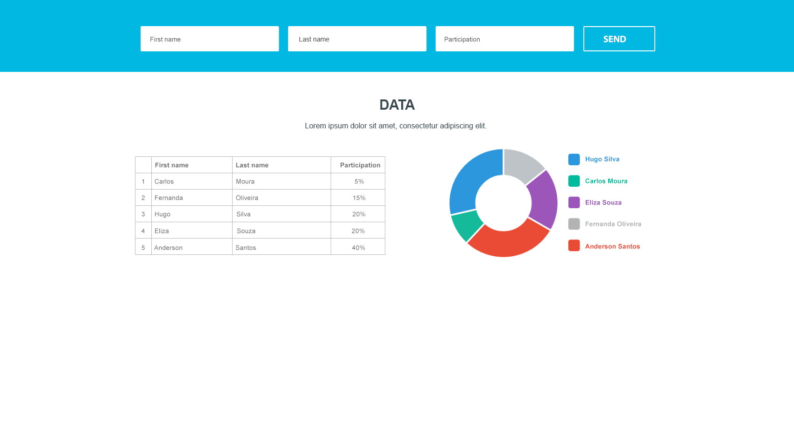

# Full-stack Engineer

O objectivo desse desafio é avaliar seu domínio no desenvolvimento fullstack: organização, estilo e boas práticas, criação de APIs, conhecimento de frameworks e tecnologias.

## Regras

1. Seu código deverá ser disponibilizado num repositório público ou privado dentro do seu github pessoal;
2. Envie o link do repositório para: it@t10.digital;
3. É necessário utilizar ReactJS e NodeJS with TypeScript, porém, sinta-se livre para utilizar bibliotecas adicionais;
4. O banco de dados a ser utilizado deverá ser o Firebase - Cloud Firestore;

## Desafio

### Front-end

O seguinte layout deverá ser desenvolvido:

- É necessário usar ReactJS, porém fique a vontade para usar outras bibliotecas;
- Todos os campos do form são obrigatórios;
- Ficaremos felizes se vc desenvolver testes!

### Back-end

O layout tem um form, uma tabela com a informação da porcentagem de participação e um gráfico pizza que representa a distribuição.

- É necessário criar APIs que envia e recebe essas informações (utilize o banco Firebase - Cloud Firestore);
- Em caso de inconsistencia, retorne um erro 400 com um JSON estruturado;
- Ficaremos felizes se vc desenvolver testes!

#### Plus

Sinta-se livre para realizar melhorias como: novos funcionalidades, otimizações visuais, segurança de API, etc. 😉

## Perguntas?

Envie suas perguntas diretamente para it@t10.digital ou entre em contato conosco! 
